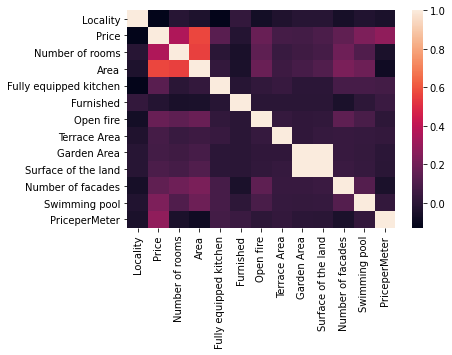

# Belgium Real Estate Price Predicition

## Objectives 

- Create a prediction model whose target is the price of a property located in any locality in Belgium. 
- Get the most accurate model possible in other terms the lowest mean absolute error possible on the prediciton of a given property.
- Implement an user interface to let anyone predict the price of a property. 

## Dataset description
- The training and test dataset comes from data scrapped by myself from the site [Immoweb](https://www.immoweb.be/) and [LogicImmo](https://www.logic-immo.be/).

### Shape

- The dataset is initially composed of 60 000 entries and 17 features each.
#### Features list

1. Locality : The locality where the property is located.
2. Type of property : Either "house" or "appartment".
3. Price : A float number in euros.
4. Number of rooms : A float number.
5. Area : A float in square meter.
6. Fully equipped kitchen : A boolean either true or false.
7. Furnished : *Does the property come in with furniture ?* A boolean either true or false.
8. Open fire : *Does the property have an open fire ?* A boolean either true or false.
9. Terrace Area : A float number representing the size of the terrace in square meter. Is equal to 0.0 if the property has no terrace.
10. Garden Area : A float number representing the size of the garden in square meter. Is equal to 0.0 if the property has no garden.
11. Surface of the land : A float number representing th total surface of the property in square meter.
12. Number of facades : A float number representing the number of facades of the property.
13. Swimming pool : A boolean. Either true or false.
14. State of the building : Either 'medium', 'good', 'new', 'to renovate', regarding the state of the property.
15. Province : One of the ten Belgium provinces.
16. Region : One of the 3 Belgium region.
17. PriceperMeter : A float number in euros

## WorkFlow

The different
## Data analysis
Some insights on the dataset. 

Price correlation with the other features : 

Locality                 -0.130485  
Price                     1.000000  
Number of rooms           0.358333
Area                      0.566414
Fully equipped kitchen    0.130774
Furnished                -0.021918
Open fire                 0.172021
Terrace Area              0.075740
Garden Area               0.072211
Surface of the land       0.090717
Number of facades         0.148417
Swimming pool             0.230451
PriceperMeter             0.277311  

Heatmap : 

## Data preprocessing

Some features needed to be transformed to be able to train and test our model with it. 
Here are the said transformation and the respective library used:

- One-Hot encoding the categorical columns => [One-Hot Encoder](https://scikit-learn.org/stable/modules/generated/sklearn.preprocessing.OneHotEncoder.html)
- Scaling the numerical columns and the encoded categorical columns => [StandardScaler](https://scikit-learn.org/stable/modules/generated/sklearn.preprocessing.StandardScaler.html)
- Handle the missing data in the dataset => [SimpleImputer](https://scikit-learn.org/stable/modules/generated/sklearn.impute.SimpleImputer.html)
- Separating the data between the train and the test set => [train_test_split](https://scikit-learn.org/stable/modules/generated/sklearn.model_selection.train_test_split.html?highlight=train_test_split#sklearn.model_selection.train_test_split)

The preprocessing steps described above were carried through two separate pipelines. A numerical_pipeline for the numerical columns and a categorical_pipeline for the categorical values. 
I used the convenient [make_pipeline](https://scikit-learn.org/stable/modules/generated/sklearn.pipeline.make_pipeline.html) and [make_column_transformer](https://scikit-learn.org/stable/modules/generated/sklearn.compose.make_column_transformer.html) from Scikit-Learn to configure those pipelines.

## Determining a baseline for the model

In this step I calculated what the results of a prediction model would be if we only guessed at property prices. 
The purpose of this is to have a basis for better understanding the results of our future model.
I used the [DummyClassifier](https://scikit-learn.org/stable/modules/generated/sklearn.dummy.DummyClassifier.html).

#### The baseline for our model

- Mean squared error : 159931446339.08014
- Mean absolute error : 173117.60024260395
- Explained variance score : 0.0
- r2 score : -0.10401510078632081

## Model selection and hyperparameter tuning

Trough multiple steps of trials I tested multiples models and configuration. 
The that gave me the best results was Xgboost with a BaggingRegressor. 
I used [GridSearch](https://scikit-learn.org/stable/modules/generated/sklearn.model_selection.GridSearchCV.html)
to find the best hyperparameters.

## Model Evaluation
Here are the results of the model against the testing data : 

- Mean squared error : 31022727615.411995
- Mean absolute error : 86094.01882551557
- Explained variance score : 0.7577142613146228
- r2 score : 0.7574321295725

## Results interpretation

When estimating the price of something I think the main indicator to take into consideration is the MAE (Mean Absolute Error).  

*Why the MAE instead of the MSE?*  

Because it will give us on average the difference between our predicted price and the target price.
Moreover, it is much easier to interpret it in the scale of our real data. 
Another argument is that the size of an error is linear with its magnitude. 
In view of these points, it is more logical to rely on the MAE.   
It can be observed that the MAE have decreased significantly, its almost halved.  

On average there is a 80 000 euros difference between the price estimated by the model and the actual price. 
In reflexion to the prices available on the belgian market its still quite a high difference. 

## Possible improvements
As the data cleaning and hyperparameter tuning has already been done in depth, I think the main focus should be on adding new features.  

For example we could add the median price of the locality for each property. This information could be calculated by hand with the data already obtained but this could be dangerous. 
*Why? because the number of properties listed for sale per locality varies greatly. Let's say we compare 2 communes, commune A and commune B. 
In commune A there are 300 houses for sale while in commune B there is only one. The median price of commune A would be representative of the commune prices but the median price of commune B would be the exact price of the one property listed for sale in the commune.  

To remedy this we could incorporate the median prices per locality listed on [StatBel](https://statbel.fgov.be/en)
To go even deeper into the information available for each property, one could retrieve information on the neighbourhood in which the property is located. Here are some questions that could be interesting and determining in the price of a house or a flat.

*How far away is the nearest public transport?*  

*How far is it to the schools?*  

*How far is it to the nearest supermarket?*  

*How long does it take for the emergency services to get to the house?*  

